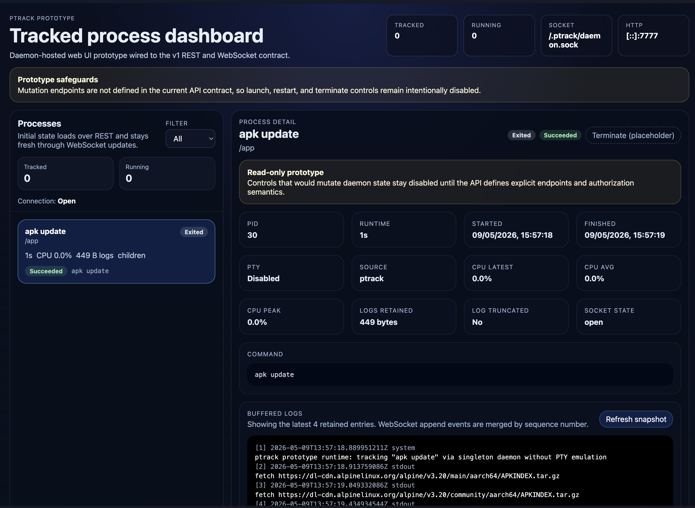

# ptrack

`ptrack` is a process tracker that wraps CLI commands, keeps a single long-lived daemon running per workspace, and exposes tracked process state over HTTP and WebSocket for both a standalone React UI and a reusable React component library.

**Docs:** [API documentation](docs/api.md) · [React component documentation](docs/components.md) · [OpenAPI stub](api/openapi.yaml)



## Why this is awesome

`ptrack` is especially useful when your code is running inside Docker and you do not want to guess what happened inside the container.

Prefix a command with `ptrack`, start it in your image or Compose setup, and you immediately get:

- a live process entry in the web UI
- status updates when the process starts, keeps running, or exits
- buffered output that lets you see exactly what the command printed
- child-process visibility so parallel work inside the tracked process tree is easier to understand

That means you can launch your app, open the dashboard, and actually watch what is happening instead of jumping between terminals, container logs, and half-finished guesses. When something fails, you can see the output, the final state, and the runtime details in one place. When it works, you get a clean confirmation that the code inside the Docker image really started and stayed alive.

## What it does

- tracks only commands launched with the `ptrack` prefix
- auto-starts or reuses one background daemon per workspace
- records process lifecycle, runtime, exit state, logs, and child-process snapshots
- exposes process data over:
  - REST under `/api/v1/*`
  - WebSocket at `/api/v1/ws`
- provides:
  - a standalone React dashboard in `apps/ptrack-web`
  - reusable UI components in `packages/ptrack-components`

## Repository layout

- `cmd/ptrack` — CLI entrypoint
- `internal/daemon` — daemon service and runtime tracking
- `internal/daemonctl` — daemon singleton control and wrapper-to-daemon registration
- `internal/api` — REST and WebSocket endpoints
- `internal/tracker` — in-memory process registry and event fan-out
- `internal/stream` — bounded log buffering
- `internal/observer` — child-process snapshots via `ps`
- `packages/ptrack-components` — reusable React hooks and components
- `apps/ptrack-web` — standalone React dashboard
- `docs/api.md` — human-readable API contract
- `api/openapi.yaml` — OpenAPI stub

## Requirements

- Go 1.24+
- pnpm 10+
- Node.js 20+ for the frontend workspace

## Install dependencies

```bash
pnpm install
```

## Run without compiling first

For quick testing, you can run the Go app directly with `go run`.

### Start only the daemon

```bash
go run ./cmd/ptrack serve
```

By default the daemon listens on `127.0.0.1:7777`.

### Run and track a command directly

```bash
go run ./cmd/ptrack echo hello
go run ./cmd/ptrack sh -c 'echo start && sleep 1 && echo done'
```

That will:

1. ensure the workspace daemon is running
2. execute the target command
3. stream output to your terminal
4. register lifecycle/log updates with the daemon

The daemon keeps its runtime state in a workspace-local `.ptrack/` directory.

## Build the Go CLI

```bash
go build -o ./bin/ptrack ./cmd/ptrack
```

Then use it normally:

```bash
./bin/ptrack serve
./bin/ptrack npm run dev
```

## Frontend development

Run the standalone React dashboard with Vite:

```bash
pnpm --filter ptrack-web dev
```

In development, Vite proxies `/api/*` and `/internal/*` to `PTRACK_HTTP_ADDRESS` when set, otherwise to the active daemon recorded in `.ptrack/daemon.json`, and finally falls back to `127.0.0.1:7777`.

Build the shared component library:

```bash
pnpm --filter @ptrack/components build
```

Build the standalone web UI:

```bash
pnpm --filter ptrack-web build
```

Build everything:

```bash
pnpm build
```

## Validation

Run the Go tests:

```bash
go test ./...
```

Run frontend checks:

```bash
pnpm --filter @ptrack/components build
pnpm --filter ptrack-web build
```

## Runtime notes

- only `ptrack`-prefixed invocations are tracked
- `ptrack serve` runs the long-lived daemon
- `ptrack <cmd>` auto-starts or reuses a single daemon per workspace
- daemon coordination state is stored in `.ptrack/`
- live process updates are sent over `/api/v1/ws`
- wrapper-to-daemon lifecycle updates use internal `/internal/processes/*` endpoints
- child-process observation is limited to the owned process tree visible through `ps`
- the current implementation executes tracked commands without PTY emulation

## Docker

Build and run with Docker:

```bash
docker build -t ptrack .
docker run --rm -p 7777:7777 ptrack
```

Or with Compose:

```bash
docker compose up --build
```

That starts:

- the Go daemon on `http://127.0.0.1:7777`
- a Vite dev UI on `http://127.0.0.1:7778`

The daemon container sets:

- `PTRACK_HTTP_ADDRESS=0.0.0.0:7777`
- `PTRACK_WEB_DIR=/app/web`

The Vite container points its API proxy at the daemon service with:

- `PTRACK_HTTP_ADDRESS=http://ptrack:7777`

If you use Compose watch, a change to `pnpm-lock.yaml` will trigger a rebuild for both the daemon image and the Vite dev container:

```bash
docker compose watch
```

## API docs

- human-readable contract: `docs/api.md`
- OpenAPI stub: `api/openapi.yaml`

## Notes

This README now describes the actual repository state. It no longer refers to the earlier session-workspace fallback used during implementation.
